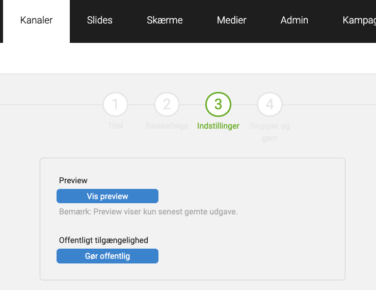
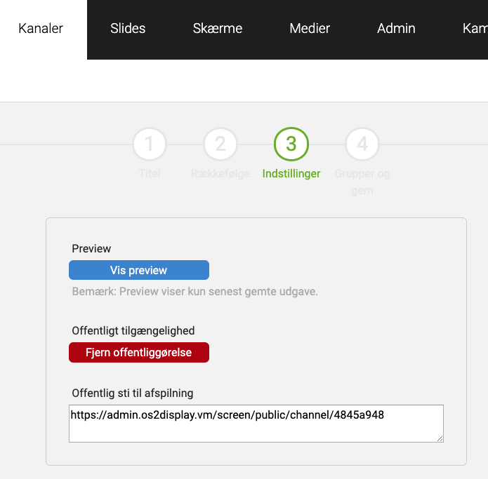
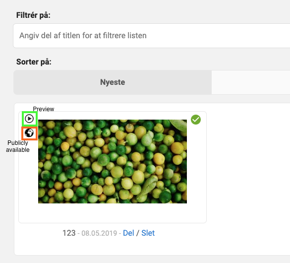
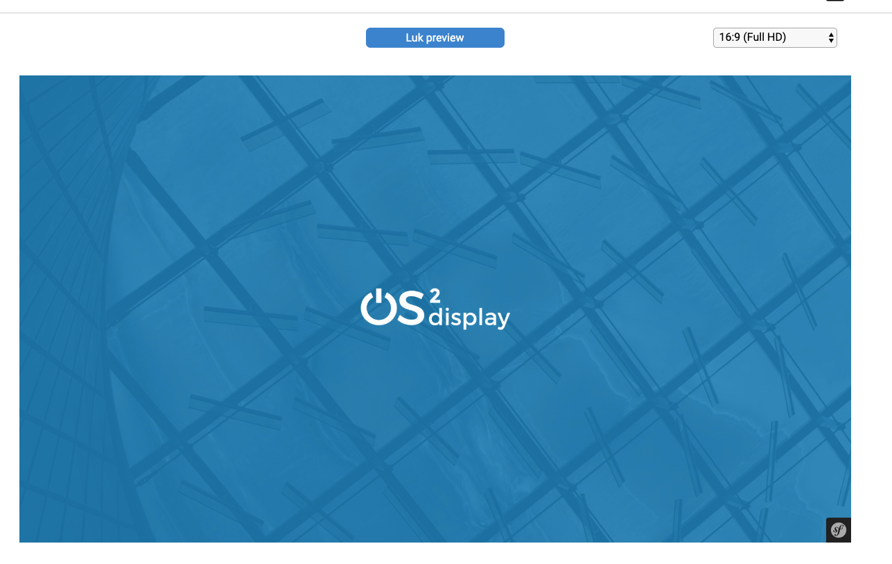

# OS2Display screen-bundle

Bundle to add a screen frontend to the administration.

## Description

This bundle adds screen as a bundle to the administration. Furthermore, it adds a new pull strategy to the frontend, where a middleware is not needed.
If this strategy is chosen the options to reload the screen from the adminstration are lost.

By moving the screen into the adminstration the possibility of a preview of screens and channels in the administration has been added.

There is also a possibility of making public channels/screens that have a public url. This url can be opened by multiple browsers and uses the pull strategi.

## Configuration

Add the following to routing.yml:

<pre>
os2display_screen:
    resource: "@Os2DisplayScreenBundle/Resources/config/routing.yml"
    prefix:   /
</pre>

Add the following to security.yml firewalls section:

<pre>
screen_bundle_public:
    pattern: ^/screen/public/(.*)
    security: false
</pre>

## nginx setup

The following should be added to the admin nginx conf.

<pre>
    location /middleware/ {
        proxy_set_header X-Real-IP $remote_addr;
        proxy_set_header X-Forwarded-For $proxy_add_x_forwarded_for;
        proxy_set_header Host $http_host;

        proxy_buffering off;

        proxy_pass http://nodejs_middleware/;
        proxy_redirect off;
    }
</pre>

Alternatively this location name can be

## Access screen with middleware

To open screen go to `/screen/`.

## Access screen without middleware

Go to the administration under a screen. Make it publicly available.
Distribute the url.

## Configuration reference

These are the default config values.

<pre>
os2_display_screen:
    strategies:
       pull:
            enabled: true
            debug: false
            log_to_console: false
            log_level: error
            update_path: /screen/serialized
            # in seconds
            update_interval: 300
        push:
            enabled: true
            debug: false
            log_to_console: false
            log_level: error
            resource:
                server: '%absolute_path_to_server%/'
                uri: 'middleware'
            ws:
                server: '%middleware_host%'
            apikey: ''
            cookie:
                secure: false
</pre>

## Images of functionality

This same functions are available for screens as for channels.

Edit channel:

Publicly available channel:

New buttons added to overview:

Preview:

